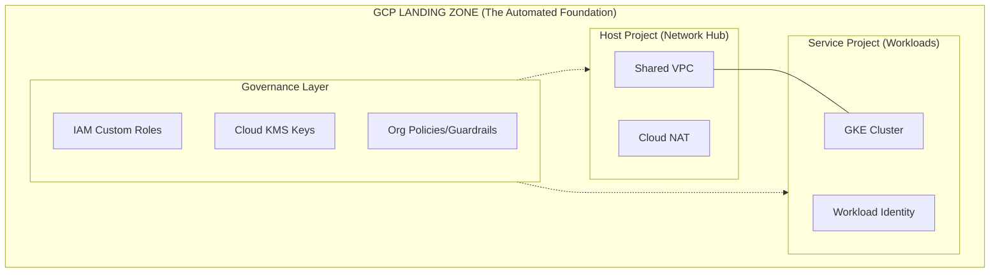
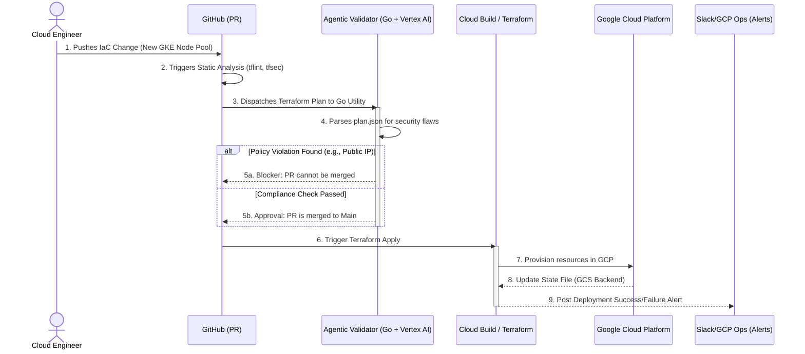

# mia-IaC-Auto-GKE-GCP-Foundation

[](https://opensource.org/licenses/MIT)
[](https://cloud.google.com/)
[](https://www.terraform.io/)

## 🏗️ Overview
This repository serves as a Proof of Concept (PoC) for a production-grade **GCP Enterprise Landing Zone**. Designed specifically for high-compliance environments (Financial Services/KPMG standards), it implements a "Security-First" architecture using GKE Private Clusters, Shared VPC networking, and Agentic AI for automated resource validation.

## 🗺️ Architectural Blueprint

### Hub-and-Spoke Network Topology
We utilize a **Shared VPC** model to centralize network control (Firewall, NAT, DNS) while allowing application teams to manage resources within Service Projects.


---


## 🚀 Key Features & JD Alignment

This project is architected to demonstrate direct mastery of the requirements outlined in the **KPMG Senior GCP Cloud Engineer** specification.

| JD Qualification | Implementation in `mia-IaC-Auto-GKE-GCP` | Technical Detail |
| :--- | :--- | :--- |
| **GKE Proficiency** | `terraform/modules/gke-hardened-private` | Implements Private Clusters, Node Auto-provisioning, and Workload Identity. Managed via Helm charts for system-critical add-ons. |
| **Compute & MIGs** | `terraform/modules/compute-mig` | Configures Managed Instance Groups with regional autoscaling and custom Health Checks to ensure high availability. |
| **GCP Networking** | `terraform/modules/shared-vpc-network` | Architected with **Shared VPC (Hub-and-Spoke)**, Cloud NAT for private egress, and Internal HTTP(S) Load Balancing. |
| **Production Terraform** | `terraform/environments/prod` | Uses remote GCS backends with state locking, modular structure for DRY code, and strict variable typing. |
| **GCP IAM & Security** | `security/iam/abac-policies` | Zero-Trust model leveraging **Workload Identity Federation** to eliminate the need for static Service Account JSON keys. |
| **Python/Go Tooling** | `services/resource-validator` | A custom **Go** utility that parses Terraform plans to enforce security guardrails (e.g., blocking public IP assignment). |
| **CI/CD Systems** | `.github/workflows/gcp-deploy.yml` | Integrated GitHub Actions pipeline simulating a Cloud Build / Argo CD GitOps workflow. |
| **SRE Principles** | `docs/compliance/sre-slo-definitions` | Defines Service Level Objectives (SLOs) and Error Budgets for the GKE control plane and ingress layer. |

---

### 🛡️ Compliance & "Well-Architected" Focus
Beyond the basic requirements, this PoC incorporates **NIST 800-53** controls and **KPMG-specific** enterprise patterns:
* **Immutable Infrastructure:** All changes are driven via GitOps; manual console changes are detected and remediated.
* **Auditability:** Cloud Audit Logs are exported to a centralized BigQuery dataset for security forensics.
* **Cost Efficiency:** Implements GKE Cost Allocation and labeling for granular billing visibility.

---

## 🛠️ Automated CI/CD & GitOps Flow

This PoC enforces an immutable infrastructure model where all changes to the GCP foundation must originate in code and pass through an automated "Quality and Compliance Gate." We leverage a **GitOps** workflow, simulating an enterprise scale implementation using GitHub Actions, Cloud Build, and Vertex AI.

### GitOps Pipeline Architecture



---
## 📂 Directory Structure
```.
├── services/             # Go/Python Tooling for Automation
│   └── resource-validator/ # Inspects TF plans for security flaws
├── terraform/            # Infrastructure-as-Code
│   ├── modules/          # Reusable modules (GKE, VPC, IAM)
│   └── environments/     # Environment-specific configs (Dev/Prod)
├── security/             # Custom IAM Roles & Cloud Armor Policies
├── docs/                 # Architecture Decision Records (ADR)
└── diagrams/             # Visual representations of the stack
```

---
## 🔒 Security & Compliance

This foundation is engineered to meet the stringent regulatory requirements of the Financial Services sector. The architecture aligns with the **NIST 800-53** framework and incorporates Google Cloud’s "Best Practices for Enterprise Organizations."

### 🛡️ Core Security Pillars
* **Zero-Trust Identity:** We utilize **GCP Workload Identity Federation**. GKE workloads are mapped to IAM Service Accounts, eliminating the risk of long-lived service account keys and preventing credential leakage.
* **Perimeter Hardening:** * **Private GKE:** Nodes are isolated from the public internet (No Public IPs).
    * **Cloud NAT:** Provides controlled egress for private instances.
    * **Cloud Armor:** (Planned) WAF policies to protect ingress points from SQLi, XSS, and L7 DDoS attacks.
* **Data Sovereignty & Encryption:** * **CMEK (Customer-Managed Encryption Keys):** Integration with **Cloud KMS** to ensure the organization maintains full control over data encryption at rest.
    * **Envelope Encryption:** Applied to all sensitive GCS buckets and GKE Persistent Disks.
* **Policy-as-Code (PaC):** We utilize **Open Policy Agent (OPA)** and **Terraform Sentinel** (simulated) to enforce organizational constraints, such as restricting resource locations and mandating specific tagging schemas for cost-center attribution.

### 📋 NIST 800-53 Control Mapping
| Control ID | Control Name | Implementation |
| :--- | :--- | :--- |
| **AC-3** | Access Enforcement | Hierarchical Firewall Policies & IAM Custom Roles |
| **IA-2** | Identification & Authentication | Workload Identity & Multi-Factor Authentication (MFA) |
| **SC-7** | Boundary Protection | Shared VPC Hub-and-Spoke with Cloud NAT |
| **AU-2** | Event Logging | Cloud Audit Logs streamed to BigQuery via Log Sinks |

---

## 🚦 Getting Started

Follow these steps to initialize the environment and run the compliance-check automation.

### Prerequisites
* [Google Cloud SDK](https://cloud.google.com/sdk/docs/install) (gcloud cli)
* [Terraform](https://developer.hashicorp.com/terraform/downloads) (v1.5.0+)
* [Go](https://go.dev/doc/install) (v1.21+) for the Resource Validator utility.
* A GCP Project with Billing enabled.

### 1. Repository Setup
```bash
git clone git@github.com:siralfbaez/mia-iac-auto-gke-gcp-foundation.git
cd mia-iac-auto-gke-gcp-foundation
cp .env.example .env
```
### 2. Initialize Terraform:

```bash
cd terraform/environments/prod
terraform init
terraform plan
```

